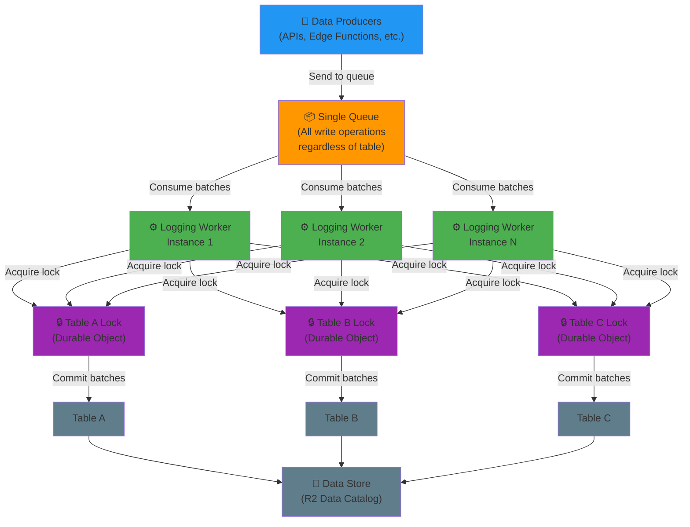

# Logging Worker - Queue-Based Batch Processor

A high-performance queue consumer service that replicates [Cloudflare Pipelines](https://developers.cloudflare.com/pipelines/) functionality with enhanced multi-table support. This worker eliminates the 1:1 pipeline-to-table limitation of traditional Pipelines by leveraging [Cloudflare Queues](https://developers.cloudflare.com/queues/) for efficient buffering and [Durable Objects](https://developers.cloudflare.com/durable-objects/) for distributed locking.

## Overview

This service provides a robust data ingestion and processing layer designed to handle high-volume logging and event streams. Instead of maintaining separate pipelines for each data catalog table, this worker manages multiple tables concurrently using a single, scalable consumer.

### Key Features

- **Queue-Based Buffering**: Decouples data producers from consumers using [Cloudflare Queues](https://developers.cloudflare.com/queues/get-started/), ensuring reliable message delivery and backpressure handling
- **Batched Commits**: Groups messages by table destination, committing each batch as a single atomic operation for consistency and performance
- **Distributed Locking**: One [Durable Object](https://developers.cloudflare.com/durable-objects/get-started/) per table guarantees exclusive access and prevents write contention/corruption
- **Table Independence**: Each table's processing pipeline operates independently—failures or slowdowns in one table don't cascade to others
- **Scalability**: Horizontal scaling through multiple worker instances, each processing shares of the queue independently

## Architecture

This single-queue, multi-table design enables **horizontal scalability** while maintaining strong consistency guarantees through per-table distributed locks.



**Key Design Points:**

- All producers write to a **single, unified queue** regardless of target table or namespace
- Multiple worker instances consume from the same queue, sharing the load
- Workers intelligently route messages to the appropriate per-table Durable Object lock based on the message's destination
- Each table's lock is independent, allowing parallel processing of different tables without contention

## How It Works

1. **Message Ingestion**: Data producers send all write operations to a **single [Cloudflare Queue](https://developers.cloudflare.com/queues/)** regardless of target table, database, or namespace. The queue acts as a reliable buffer, surviving worker restarts and handling backpressure.

2. **Batch Assembly**: The logging worker consumes messages from the single queue and intelligently routes them by destination table. Messages targeted at the same table are grouped together and held until a batch size threshold or timeout is reached.

3. **Distributed Locking**: Before committing a batch, the worker acquires an exclusive lock via a [Durable Object](https://developers.cloudflare.com/durable-objects/best-practices/access-durable-objects-storage/) dedicated to that table. This prevents concurrent writes to the same table from different worker instances.

4. **Atomic Commit**: With the lock held, the batch of messages is committed to the data catalog as a single commit, ensuring consistency.

5. **Lock Release & Acknowledgment**: After the commit succeeds, the lock is released and messages are acknowledged to the queue, marking them as processed.

6. **Independence**: Each table's Durable Object operates independently—Table A's processing doesn't block Table B, enabling fine-grained parallelism.

## Comparison to Cloudflare Pipelines

| Aspect              | Cloudflare Pipelines       | This Logging Worker                                                                                           |
| ------------------- | -------------------------- | ------------------------------------------------------------------------------------------------------------- |
| Tables per Pipeline | 1 (1:1 mapping)            | Many (1:N)                                                                                                    |
| Buffering           | Built-in                   | [Queues](https://developers.cloudflare.com/queues/)                                                           |
| Concurrency Control | Pipeline-level             | Per-table (Durable Objects)                                                                                   |
| Scalability         | Limited by single pipeline | Horizontal via queue distribution                                                                             |
| Custom Logic        | Limited transformations    | Full TypeScript/Hono flexibility                                                                              |
| Write Contention    | Not addressed              | Resolved via [DO locks](https://developers.cloudflare.com/durable-objects/concepts/what-are-durable-objects/) |

## Use Cases

- **Event Streaming**: Ingest events from multiple services into separate analytics tables
- **Log Aggregation**: Buffer and batch logs from distributed sources to a central data store
- **Real-time Data Sync**: Replicate data from transactional systems to analytical databases
- **Change Data Capture (CDC)**: Process and store database change events in an ordered, batched manner

## Configuration

Configure queue consumption and batch settings via `wrangler.jsonc`:

```jsonc
{
	"queues": {
		"consumers": [
			{
				"queue": "events",
				"max_batch_size": 100,
				"max_batch_timeout": 30,
				"max_retries": 3,
				"dead_letter_queue": "events_dlq",
			},
		],
	},
	"durable_objects": {
		"bindings": [
			{
				"name": "TABLE_LOCKS",
				"class_name": "TableLock",
				"namespace_id": "your_namespace_id",
			},
		],
	},
}
```

See [Cloudflare Queues Configuration](https://developers.cloudflare.com/queues/configuration/configure-queues/) and [Durable Objects Reference](https://developers.cloudflare.com/durable-objects/reference/durable-objects-migrations/) for more details.

## Performance Considerations

- **Batch Size**: Larger batches reduce transaction overhead but increase latency. Tune `max_batch_size` based on your workload.
- **Timeout**: Short timeouts ensure fresher data; longer timeouts enable better batching efficiency. Set `max_batch_timeout` appropriately.
- **Durable Object Contention**: If a single table receives heavy traffic, the lock may become a bottleneck. Consider partitioning high-volume tables.
- **Queue Throughput**: [Cloudflare Queues](https://developers.cloudflare.com/queues/#quotas-and-limits) have rate limits; monitor queue depth and consumer lag.

## Links & References

- [Cloudflare Queues Documentation](https://developers.cloudflare.com/queues/)
- [Cloudflare Durable Objects](https://developers.cloudflare.com/durable-objects/)
- [Cloudflare Pipelines](https://developers.cloudflare.com/pipelines/)
- [Hono Web Framework](https://hono.dev/) (used for request routing)
- [TypeScript Worker Configuration](https://developers.cloudflare.com/workers/wrangler/configuration/)
